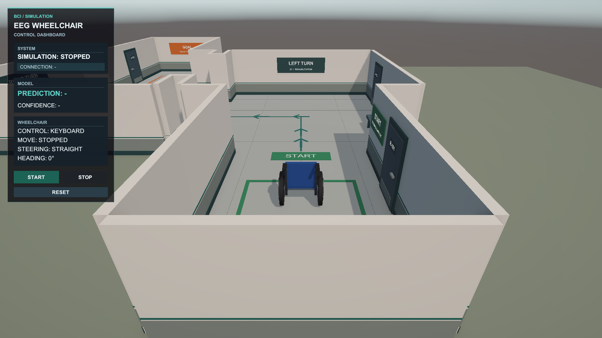

# Unity — EEGWheelchairSimulator

운동 상상 뇌파 기반 가상 휠체어 방향 제어 시스템의 **Unity 시뮬레이터**입니다.

현재는 키보드 및 Python 테스트 송신기를 이용해 이동·통신·HUD를 검증한 단계입니다. **실제 EEG 데이터 처리와 분류 모델은 아직 이 Unity 프로젝트에 연결하지 않았습니다.** Python 테스트의 confidence도 실제 모델 성능을 의미하지 않습니다.



## 1. 구현 현황

| 단계 | 구현 내용 |
|---|---|
| 개발 1 | MainScene, 40×40 Ground, 임시 휠체어 루트와 기본 카메라 |
| 개발 2 | New Input System 기반 W/↑ 전진, A/← 좌회전, D/→ 우회전; 이동·입력 책임 분리 |
| 개발 3 | LateUpdate 기반 부드러운 3인칭 추적 카메라 |
| 개발 4 | 실제 이동 상태를 표시하는 Control / Move / Steering / Heading HUD |
| 개발 5 | 공통 SimulationController, START / STOP / RESET, 초기 Transform 복원 |
| 개발 6 | 로컬 TCP + NDJSON 수신, 메인 스레드 전달, 입력원 선택, 연결 해제 정지·재접속 |
| 개발 7 | 가짜 prediction 스트림, sequence, Connection / Prediction / Confidence HUD |
| 에셋 1 | Primitive 조합 WheelchairVisual Prefab. 기존 이동 루트·참조 유지 |
| 에셋 2 | 직선·좌회전·우회전·START·GOAL이 있는 IndoorTestCourse Prefab |
| 에셋 3 | 환경 Material, 조명, 안내선, 표지판, 문·벽·소품 디테일 개선 |
| UI 1 | SYSTEM / MODEL / WHEELCHAIR 카드형 HUD. 데이터 참조와 버튼 이벤트 유지 |

### 아직 구현하지 않은 범위

- 실제 PhysioNet 데이터 재생, 전처리, EEG 분류 모델 연결
- confidence threshold, Rest/Hold 판정, 다수결, 자동 전진 정책
- EEG 파형, 실제 라벨, accuracy/F1, latency 측정 UI
- 벽 충돌 방지, Rigidbody 이동, NavMesh, 카메라 충돌 회피, 바퀴 애니메이션

팀 전체 README의 Left/Right/Hold는 최종 계획입니다. **현재 실행 가능한 Unity 명령은 LEFT/RIGHT/FORWARD/STOP뿐이며 HOLD/REST/IDLE은 허용하지 않습니다.**

## 2. 개발 환경

| 항목 | 버전 / 방식 |
|---|---|
| Unity Editor | **6000.3.24f1 (Unity 6.3 LTS)** |
| Render Pipeline | URP 17.3.0 |
| Input | Input System 1.20.0, New Input System만 사용 |
| UI | uGUI 2.0.0, Text / Image / Button, Unity 내장 폰트 |
| Python 테스트 도구 | Python 3.6 이상, 표준 라이브러리만 사용 |
| 검증 OS | Windows 11 |

추가 유료 Asset, 외부 폰트, 별도 Python 패키지는 필요 없습니다. Unity 패키지 버전은 `Packages/manifest.json`과 `packages-lock.json`에 포함되어 있습니다.

## 3. 처음 실행하기

```powershell
git clone --branch unity https://github.com/itsjiyunbro/MI-Wheelchair-Control.git
```

1. Unity Hub에서 Unity **6000.3.24f1**을 준비합니다.
2. Add / Open으로 `MI-Wheelchair-Control/unity/EEGWheelchairSimulator` 폴더를 선택합니다. 저장소 최상위 `MI-Wheelchair-Control`을 Unity 프로젝트로 열지 않습니다.
3. 최초 패키지 복원과 Asset import가 끝날 때까지 기다립니다. `Library`는 자동 생성됩니다.
4. Project 창에서 **Assets/Scenes/MainScene.unity**를 엽니다.
5. 기존 Scene이 완성된 상태이므로 Step 1~7 생성 메뉴를 다시 실행하지 않습니다.
6. Game View는 우선 **1920×1080 또는 16:9**로 설정합니다.

> 현재 Build Settings의 기본 Scene은 템플릿의 `SampleScene`입니다. Editor 시연은 `MainScene`을 직접 열어 진행합니다. 실행 파일을 빌드할 때는 Build Profiles / Scene List에서 `MainScene`을 첫 번째 활성 Scene으로 등록해야 합니다. 이번 업로드에는 실행 파일이 포함되지 않습니다.

### Keyboard 모드

1. Hierarchy의 `SimulationController` 선택 → Inspector의 **Control Source = Keyboard**.
2. Play → 초기 `SIMULATION: STOPPED` 확인. 이때 키를 눌러도 움직이지 않습니다.
3. **START** 클릭 후 Game View에 포커스를 두고 조작합니다.

| 입력 | 동작 |
|---|---|
| W 또는 ↑ | 누르는 동안 전진 |
| A 또는 ← | 누르는 동안 좌회전 (제자리 회전 가능) |
| D 또는 → | 누르는 동안 우회전 |
| W+A / W+D | 전진하면서 회전 |
| A+D | 조향 상쇄 |
| 키 놓기 | 해당 이동·회전 정지 |

기본 이동 속도는 2m/s, 회전 속도는 60°/s입니다. 후진은 구현하지 않았습니다.

### START / STOP / RESET

- **START:** RUNNING 전환. 이후 입력 허용.
- **STOP:** 현재 위치·방향을 유지하며 명령을 즉시 제거하고 STOPPED 전환.
- **RESET:** Play 시작 시 저장한 위치·방향으로 복원, 카메라 즉시 정렬, 명령 제거 및 STOPPED 전환.
- STOPPED여도 카메라·HUD·Python 메시지 수신은 계속 동작합니다.
- 다시 START할 때 과거 Python 명령을 자동 재실행하지 않고 이후 새 메시지부터 적용합니다.

## 4. Python 테스트

Unity에서 `Control Source = Python` → Play를 먼저 실행합니다. PowerShell을 **저장소 최상위 폴더**에서 열고 아래 명령을 실행합니다.

```powershell
# 수동 입력: left / right / forward / stop, 종료: quit
py -3 .\unity\EEGWheelchairSimulator\Tools\PythonTestSender\send_commands.py

# 가짜 prediction 스트림: 기본 1초 간격, 종료: Ctrl+C
py -3 .\unity\EEGWheelchairSimulator\Tools\PythonTestSender\stream_sender.py

# 제안서의 0.25초 갱신 간격으로 전송량 테스트 (실제 EEG 추론이 아님)
py -3 .\unity\EEGWheelchairSimulator\Tools\PythonTestSender\stream_sender.py --interval 0.25
```

`py` 대신 설치된 `python` 또는 팀 venv의 Python 실행 파일을 사용할 수 있습니다.

기존 Windows 런처도 포함되어 있습니다.

```powershell
powershell -NoProfile -ExecutionPolicy Bypass -File .\unity\EEGWheelchairSimulator\Tools\PythonTestSender\run_sender.ps1 -Stream
```

런처는 `py -3` → `python` → 프로젝트 venv → Codex 내부 Python(존재할 때만 임시 fallback)을 탐색하며 선택한 환경을 표시합니다. **다른 팀원 PC에서 Codex Python은 필요하지 않습니다. 일반 Python 환경 사용을 권장합니다.** 런처는 Python을 설치하거나 시스템 실행 정책을 영구 변경하지 않습니다.

수동 송신기와 스트림 송신기를 동시에 연결하지 않습니다. 현재 listener는 한 번에 한 클라이언트를 처리합니다.

### 정상 동작 확인

1. 연결 시 `CONNECTION: CONNECTED`.
2. START 전에는 Prediction/Confidence만 바뀌고 휠체어는 정지.
3. START 후 새 명령부터 휠체어 동작.
4. STOP 후 즉시 정지. 수신과 Prediction HUD 갱신은 계속.
5. 송신기 종료 시 정지, `WAITING`, Prediction/Confidence는 `-`.
6. 송신기 재실행 시 재접속 가능.

## 5. 임시 통신 규격

**Temporary development protocol / v0.2 — 최종 팀 규격이 아닙니다. v0.1과 호환됩니다.**

| 항목 | 값 |
|---|---|
| Transport | TCP |
| Unity listener | 127.0.0.1:5055 |
| Direction | Python → Unity |
| Encoding / Framing | UTF-8 / NDJSON, JSON 1개마다 줄바꿈 `\n` 필수 |

```json
{"command":"LEFT","confidence":0.87,"timestamp":1726362000.125,"sequence":12}
```

- `command`: LEFT / RIGHT / FORWARD / STOP
- `confidence`: 0~1의 유한 숫자. 표시·보관만 하며 제어 판단에 사용하지 않음
- `timestamp`: 송신 Unix timestamp. 보관하며 현재 latency 계산에는 사용하지 않음
- `sequence`: 1부터 증가하는 메시지 번호. 필드가 없는 v0.1 메시지도 허용

| TCP 명령 | 현재 임시 동작 |
|---|---|
| FORWARD | 전진, 조향 0 |
| LEFT | 전진 0, 좌회전 지속 |
| RIGHT | 전진 0, 우회전 지속 |
| STOP | 이동·조향 0. Simulation 자체를 STOPPED로 바꾸지는 않음 |

명령은 다음 유효 명령, Unity STOP/RESET, 입력원 변경 또는 연결 해제까지 유지됩니다. **연결만 살아 있고 메시지가 멈춘 경우를 위한 timeout 정책은 아직 없습니다.** 알 수 없는 명령·잘못된 JSON/필드/범위는 무시하며 필요 시 Warning을 남깁니다.

실제 Left/Right 이진 모델에는 FORWARD 클래스가 없으므로, 최종 시연 전 기본 전진·조향·판단 보류 정책을 팀에서 별도로 결정해야 합니다.

## 6. 구조와 책임

```text
KeyboardWheelchairInput ────────────────┐
                                       ▼
Python sender → TCP worker → queue → PythonWheelchairReceiver
                                       │ Unity main thread
                                       ▼
                              WheelchairMovement
                                       ▲
                              SimulationController
                              (공통 입력 허용/차단)

CameraFollow → 휠체어 Transform 추적
WheelchairStatusUI → Simulation / Receiver snapshot / Movement 상태 표시
```

- `WheelchairMovement`: Transform 기반 XZ 이동, Y축 회전, 입력원 및 Simulation 상태 확인.
- `KeyboardWheelchairInput`: New Input System Keyboard로 개발용 입력 생성.
- `TcpNdjsonListener`: 백그라운드 TCP 읽기와 thread-safe queue. Unity API를 조작하지 않음.
- `PythonWheelchairReceiver`: 메인 스레드 JSON 검증·수신 상태 반영·Movement 명령 전달.
- `SimulationController`: 입력원 선택, START/STOP/RESET, 초기 위치와 카메라 복원.
- `WheelchairStatusUI`: 수신 Prediction과 실제 Move/Steering을 별도로 표시.
- `CameraFollow`: LateUpdate 추적. Offset (0,4.5,-7).

Python은 EEG 전처리·학습·추론을 담당하고 Unity는 결과 수신·제어·표시를 담당합니다.

## 7. Scene / 에셋 / HUD

```text
MainScene
├─ Ground (40×40)
├─ WheelchairPlaceholder  # 이동·입력 컴포넌트 및 기존 참조 유지
│  └─ WheelchairVisual   # Primitive 기반 시각 Prefab
├─ Main Camera + CameraFollow
├─ Directional Light / Global Volume
├─ IndoorTestCourse      # 환경 Prefab
├─ SimulationController
├─ StatusCanvas / StatusPanel
│  ├─ HudChrome          # SYSTEM / MODEL / WHEELCHAIR 카드·장식
│  ├─ 기존 상태 Text     # 데이터 바인딩 유지
│  └─ START / STOP / RESET
└─ EventSystem           # InputSystemUIInputModule
```

- 휠체어 루트의 원래 Cube MeshRenderer는 비활성화. 자식 WheelchairVisual이 보이는 모델입니다.
- 코스: START (0,0) → (0,7)에서 좌회전 → (-9,7)에서 우회전 → GOAL (-9,15), 좌표는 XZ 기준입니다.
- 복도 폭 약 5m, 코너 약 8×8m, 벽 높이 약 2.6m. 벽 통과 방지는 이번 구현 범위가 아닙니다.
- HUD: 1920×1080 기준 왼쪽 위 340×622px, Canvas Scaler로 해상도 대응.
- 환경 Material은 `Assets/Art/Materials/Environment`, Prefab은 `Assets/Art/Prefabs`에 있습니다.

## 8. 프로젝트 파일과 문서

```text
unity/
├─ README.md
├─ images/unity-demo.png
└─ EEGWheelchairSimulator/
   ├─ Assets/            # Scene, runtime C#, Editor 도구, Prefab, Material, .meta
   ├─ Packages/          # manifest + lock
   ├─ ProjectSettings/   # Unity 버전, Input, URP 등
   ├─ Docs/              # 단계별 설명과 검증 기록
   └─ Tools/PythonTestSender/
      ├─ send_commands.py
      ├─ stream_sender.py
      └─ run_sender.ps1
```

- [단계별 문서](EEGWheelchairSimulator/Docs/)
- [TCP 수동 테스트 안내](EEGWheelchairSimulator/Tools/PythonTestSender/README.md)
- [Prediction 스트림 안내](EEGWheelchairSimulator/Tools/PythonTestSender/README-Stage07.md)
- [실내 환경](EEGWheelchairSimulator/Docs/IndoorTestCourse-Polish.md)
- [HUD 디자인](EEGWheelchairSimulator/Docs/DemoHUD-Polish.md)

단계별 문서는 개발 당시 기록입니다. 현재 전체 실행 방법은 이 README를 우선 확인하세요. 예전 문서의 Cube 표현은 현재 WheelchairPlaceholder 루트/자식 시각 모델을 의미합니다. `<저장소 경로>`는 각 PC의 clone 경로로 바꿔야 합니다.

Editor 생성·스타일 메뉴는 `Tools > EEG Wheelchair`에 있습니다. 이미 Scene에 연결돼 있으므로 일반 실행에 메뉴 재실행이나 Inspector 수동 연결은 필요하지 않습니다. 초기 단계 생성 메뉴는 현재 레이아웃을 재적용할 수 있으므로 무작정 실행하지 마세요.

## 9. 검증 기록 / 협업 시 주의

기존 개발 과정에서 Unity 컴파일, Scene 저장·재로드, 실제 Play Mode 키보드·버튼 클릭, Python TCP/스트림·재접속, STOP/RESET, HUD와 카메라를 검증했습니다. HUD는 1920×1080, 1600×900, 1280×720 및 4:3 보조 캡처를 확인했습니다. 이는 실제 EEG 분류 성능이나 실제 휠체어의 안전성 검증을 의미하지 않습니다.

업로드에는 `Library`, `Temp`, `Logs`, `UserSettings`, IDE 자동 생성 파일, Python venv 및 EEG 원본 데이터가 포함되지 않습니다. `Assets`의 `.meta` 파일은 Scene/Prefab 참조를 보존하므로 반드시 함께 커밋합니다.

MainScene을 수정할 때는 담당자 간 작업 범위를 먼저 맞추고, 입력·통신·HUD 바인딩을 유지해 주세요. 새 입력 정책이나 JSON 필드 변경은 Python 담당자와 합의한 뒤 임시 규격 문서도 함께 갱신합니다.

이번 업로드 준비(2026-09-24)에서는 원본 Library 없이 복사본을 Unity 6000.3.24f1로 새로 import/compile하여 exit code 0을 확인했습니다. Python 문법, 패키지 JSON, README 링크, Assets의 .meta 누락 여부도 점검했습니다. 런타임·Scene·Prefab 파일은 원본과 동일하게 보존했습니다.
