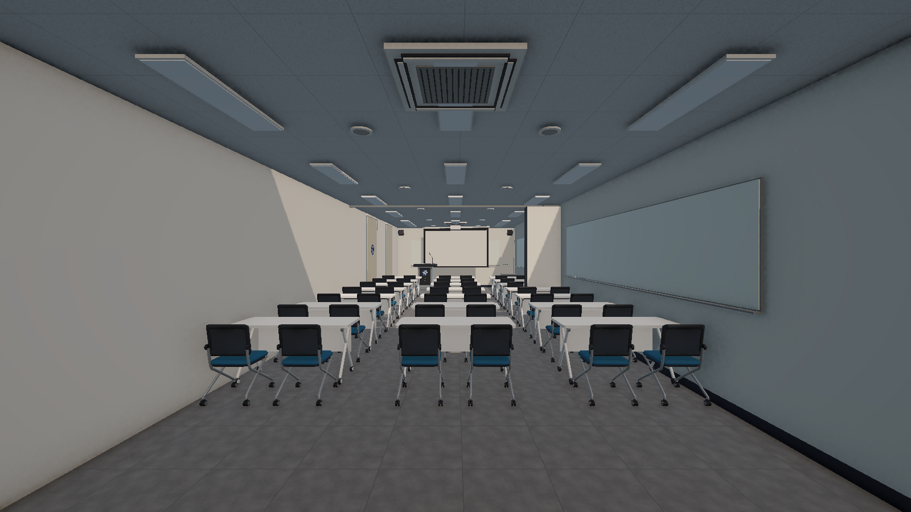
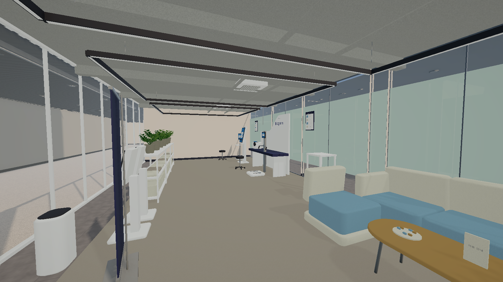

# Unity - 컨버전스홀 B1 휠체어 시뮬레이터

2026-10-08 기준. `unity`에서 분기한 `codex/unity-convergence-hall-b1` 작업 브랜치입니다.

컨버전스홀 지하 1층을 안내도와 현장 사진 기준으로 구현했습니다. 실제 EEG 모델 연결 전 단계이며 키보드와 Python 테스트 송신기로 주행·통신을 확인할 수 있습니다.




## 처음 실행하기

```powershell
git clone --branch codex/unity-convergence-hall-b1 --single-branch https://github.com/itsjiyunbro/MI-Wheelchair-Control.git
```

1. Windows에서는 `C:\Projects`처럼 짧은 경로에 복제하세요. 경로가 길면 Unity 패키지 임포트가 실패할 수 있습니다. Unity Hub에서 **Unity 6000.3.24f1**을 준비합니다.
2. `unity/EEGWheelchairSimulator` 폴더를 Unity 프로젝트로 엽니다.
3. 최초 패키지 복원과 에셋 임포트가 완료될 때까지 기다립니다.
4. `Assets/Scenes/ConvergenceHallB1Scene.unity`를 엽니다.
5. Control Source를 **Keyboard**로 설정하고 Play, **START** 순서로 시작합니다.

완성된 Scene과 Prefab이 포함돼 있으므로 환경 생성 메뉴를 다시 실행할 필요는 없습니다. `MainScene`, 실내 테스트 코스와 재활 코스도 함께 보존했습니다. 실행 파일은 포함하지 않습니다. 빌드할 때는 Build Profiles의 Scene List에 B1 장면을 등록하세요.

## 조작법

| 모드 | 입력 | 동작 |
|---|---|---|
| 휠체어 | W / ↑ | 전진 |
| 휠체어 | S / ↓ | 후진 |
| 휠체어 | A / ←, D / → | 좌우 회전 |
| 휠체어 | E / 문 버튼 | 가까운 문 열기·닫기 |
| 휠체어 | V / 시점 버튼 | 1인칭·3인칭 전환 |
| 공통 | F / 자유 시점 버튼 | 자유 카메라 진입·복귀 |
| 자유 카메라 | WASD | 카메라 이동 |
| 자유 카메라 | Q / E | 하강 / 상승 |
| 자유 카메라 | 우클릭 드래그 | 시선 회전 |
| 자유 카메라 | Shift / 마우스 휠 | 가속 / 속도 조절 |
| 자유 카메라 | R / 문 버튼 | 가까운 문 열기·닫기 |
| 자유 카메라 | H | 안내 화면 숨김·표시 |
| 자유 카메라 | F / ESC | 휠체어 시점으로 복귀 |
| 공통 | START / STOP / RESET | 시작 / 정지 / 시작 위치 복귀 |

전진 기본 속도는 2m/s, 후진은 1.2m/s입니다. 자유 시점에서는 휠체어가 정지하고 카메라만 이동합니다. 자유 시점 복귀 후 START를 눌러 주행을 재개합니다. 휠체어에는 벽·가구·문 충돌을 적용하고, 자유 카메라는 벽을 통과할 수 있습니다.

## 구현한 공간과 기능

- 주출입구, 복도 바닥·천장, 유리의 불투명 띠, 안내판·표지판과 벽 마감.
- 블루벨리 계단·스탠드·유리 난간·상부 전광판 외형, 두 계단실 아래 창고.
- B112 옆 동쪽 콘크리트 엘리베이터실과 B109 옆 서쪽 흰 벽 엘리베이터실, 점검문·표지판·공식 연세대학교 문양.
- B101-B110, B112-B115 강의실 14개와 사진 기반 책상·의자·천장.
- B112의 책상 21개·학생 의자 42개, 교탁, 화이트보드, 창문·블라인드, AV 장비와 접힌 파티션. 스크린은 테두리 포함 강의실 폭의 약 54%이며 약 12도 사선 천장 수납부에서 수직으로 내려옵니다. 뒤 화이트보드가 양옆으로 보입니다.
- 라운지의 소파·테이블·화분 선반, 단말기·건강 측정 기기 외형과 노출 천장.
- B124 양개문과 표지판, 화장실 반투명 문, 문 48개의 개폐와 자동문 센서.
- 1·3인칭, 시연용 자유 카메라, 휠체어 후진과 STOP/RESET.

추가 원본 화면은 [images/convergence/](images/convergence/)에 있습니다. 설명을 덧붙인 PDF 대신 실제 구현 화면을 포함했습니다.

## Python 입력

기존 TCP + NDJSON 테스트 입력을 유지합니다. 기본 포트는 **5055**, 현재 명령은 **LEFT / RIGHT / FORWARD / STOP**입니다. 키보드 후진은 Python 프로토콜에 새 명령을 추가하지 않습니다. HOLD/REST/IDLE 또는 실제 모델 confidence 기반 정책은 추가 작업입니다.

```powershell
cd unity/EEGWheelchairSimulator/Tools/PythonTestSender
./run_sender.ps1
# 스트림 테스트
./run_sender.ps1 -Stream -Interval 0.25 -Count 100
```

Unity의 Control Source를 Python으로 선택한 뒤 START로 주행합니다. 송신기는 Python 3.6 이상과 표준 라이브러리만 사용합니다. 메시지 필드와 실행 예시는 [송신기 안내](EEGWheelchairSimulator/Tools/PythonTestSender/README.md), [Stage07 스트림 안내](EEGWheelchairSimulator/Tools/PythonTestSender/README-Stage07.md)를 참고하세요.

## 프로젝트 파일

- 시작 장면: `Assets/Scenes/ConvergenceHallB1Scene.unity`
- 환경 프리팹: `Assets/Art/Prefabs/Environment/ConvergenceHall/ConvergenceHallB1.prefab`
- 런타임 코드: `Assets/Scripts`
- 제작·검증 도구: `Assets/Editor/EEGWheelchair`
- 상세 변경 기록: [ConvergenceHallB1-Guide.md](EEGWheelchairSimulator/Docs/ConvergenceHallB1-Guide.md)

Assets와 `.meta`, Packages, ProjectSettings, Docs, Tools를 포함합니다. Library, Temp, Logs, UserSettings, IDE 생성 파일은 제외합니다. 에셋 임포트 시 Library는 각 PC에서 다시 생성됩니다. 한글 안내 글자는 포함된 Noto Sans CJK KR 글꼴을 사용합니다. [글꼴 출처와 OFL 라이선스](EEGWheelchairSimulator/Docs/ThirdPartyFonts.md)를 함께 포함했습니다.

## 검증과 현재 범위

새로 복제한 프로젝트에서 임포트, 누락 스크립트, 저장된 B1 장면·스크린·라운지·문 48개를 확인했습니다. [최종 검증 기록](EEGWheelchairSimulator/Docs/UploadValidation-2026-10-08.md)을 포함했습니다. 실제 키·버튼과 Python 송신/재연결/잘못된 메시지, STOP/RESET, 자유 카메라, 문 48개의 30/120 FPS 개폐 96회와 출입구 34곳의 충돌을 검증하는 진입점도 포함했습니다.

```powershell
# 프로젝트 폴더를 현재 디렉터리로 두고 실행합니다.
# Unity.exe의 경로와 Python 실행 파일 경로는 본인 PC에 맞춰 입력하세요.
& '<Unity.exe 경로>' -batchmode -projectPath (Get-Location).Path `
  -executeMethod EEGWheelchairSimulator.Editor.ConvergenceHallUploadValidation.Run `
  -pythonExe '<python.exe 경로>' `
  -convergencePreviewFolder '<화면 저장 폴더>' -logFile '<검증 로그 경로>'
```

환경은 사진과 안내도에 따른 추정 비율을 포함하며 정밀 실측 모델은 아닙니다. 현재 범위는 B1입니다. 다른 층과 엘리베이터 층간 이동, 파티션 펼침, 전광판·스크린 콘텐츠 재생, 실제 건강 측정과 EEG 추론은 추가 구현 범위입니다.
